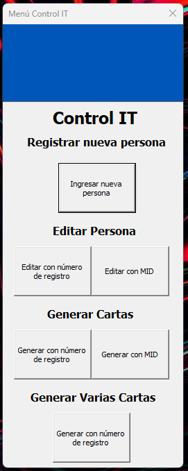
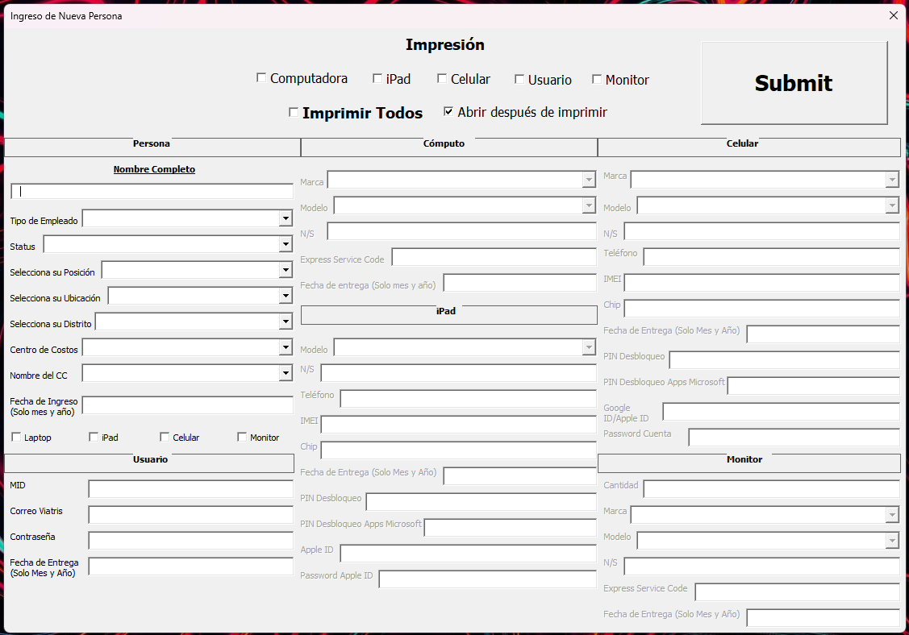
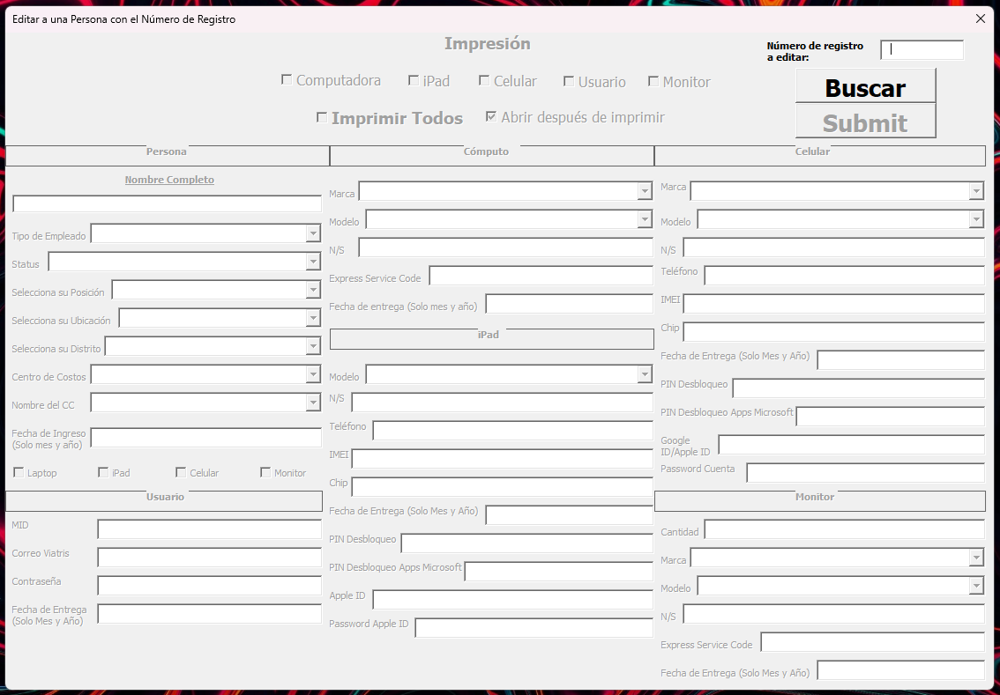
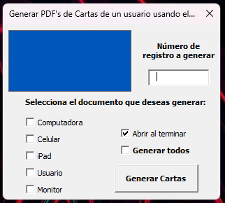
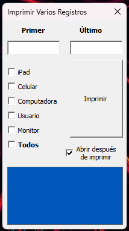
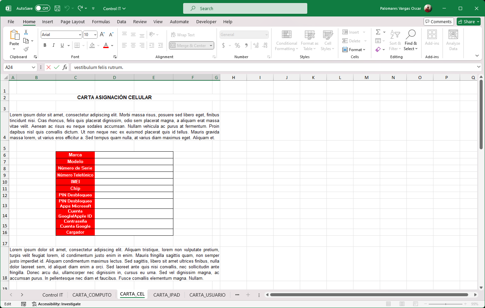

# Excel Macro Scripts Form
A VBA solution for storing user data within a company using forms for data completition and generating PDF's.
Admin creates a profile and enters all the required information, data gets stored in an Excel datasheet, Admin can automatically print a legal sheet (PDF) about the hardware delivered to the user.
All code is commented with a brief explannation about the used logic.

This was a simple data storage solution for a company need, adapting to what the business needs and has in their capabilities (Excel).

# Macro Menu

This simple menu allows you to acces into any desired form. A module must be created that instantiates this menu.
To add a new entry, we must select "Registrar a una nueva persona"

# New Entry

In here, we can add a new user into de datasheet. It's not necessary to fill in all the data in order to store the information. To unlock certain fields, you must check their checkboxes.
It is possible to print right away the legal sheets right after filing the desired data by checking the checkboxes in the print section. To save the filed data and print the desired legal sheets (not mandatory), press "Submit". "Abrir despues de imprimr" lets you choose to open the legal sheet after its creation. It's toggled on by default.

# Edit User

User edition can be achieved with a similar form by either using the register number or company ID. It's also possible to print legal sheets right away. Once the user is found, the form will be automatically filed in with the user information.

# Generate Legal Sheets

It's possible to just generate the legal sheets of any user. This can be done either with the register number or with the company ID. You can print a specific legal sheet or all the legal sheets of that specific user. It also lets you choose to open the legal sheet(s) after their creation. It's toggled on by default.

# Generate a Batch of Legal Sheets

This lets you generate specific legal sheets of many users in a desired range. It's dumb proof. It also lets you choose to open the legal sheet(s) after their creation. It's toggled on by default.

# Legal Sheet

Inside the code, you must adapt the columns, rows and cells to fill in the legal sheet and datasheet.

